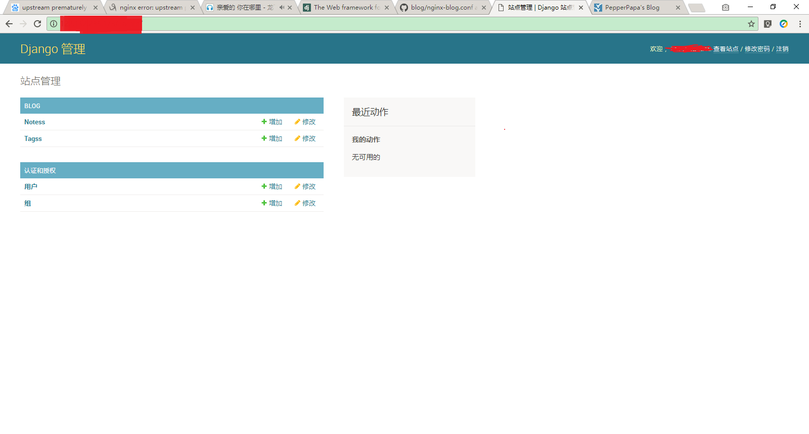

# 个人博客
>   个人开发环境信息：   
    开发系统环境：win10 64位   
    python版本: python3.6.0
    Django版本：1.11.5  
    部署系统环境： Ubuntu 16.04.2 LTS (GNU/Linux 4.4.0-53-generic x86_64)   

## 如何部署到云服务器
1. zx用户下创建目录/home/zx/projects, cd至projects目录
$ git clone -b by_django https://github.com/PepperPapa/blog.git 拷贝项目文件到本地

2. 检查依赖包，还未安装的要进行安装，本机还未安装django, virtualenv，virtualenvwrapper，django-ckeditor，Pillow
    >   依赖包:   
        git    
        python3   
        pip3    
        virtualenv	   
        virtualenvwrapper    
        django   
        django-ckeditor   
        Pillow   
        uwsgi   

	（zx用户下安装提示zx is not in the sudoers file，是因为zx没有加入到sudoers组，参考https://jingyan.baidu.com/article/2a1383284bb3e8074a134f2d.html解决）

	升级pip3
	
	安装virtualenv
	
	安装virtualenvwrapper
		~/.bashrc文件默认添加如下四行语句
	
	
	
	创建虚拟环境env1并安装django,django-ckeditor,Pillow，uwsgi
	
	
	
		
		
	3. 生成数据库文件，创建管理员账户
	$python manage.py migrate生成对应的数据文件
	
	创建管理账号： 
	
	4. settings.py配置文件根据本机更新
	配置ALLOWED_HOSTS为云主机公网ip
	
	MEDIA_URL更新为云主机公网ip地址
	
	5. ~/Envs/env1/lib/python3.5/site-packages/ckeditor/static/ckeditor/ckeditor/plugins/image/dialogs/image.js修改文件将
	id:"Upload",hidden:!0修改为id:"Upload",hidden:0
	
	nginx配置（myblog_nginx.conf），根据项目及用户的实际目录进行更新
	
	/etc/nginx/sites-enabled目录下创建指向myblog_nginx.conf文件的链接，并删除default链接
	
	uwsgi配置（myblog_uwsgi.ini），根据项目及用户的实际目录进行更新
	
	6. 启动服务
	/etc/init.d/nginx start 启动nginx服务器
	
	myblog目录启动uwsgi，$uwsgi myblog_uwsgi.ini
	
	6. 访问博客及后台
	
	
	测试帖
	